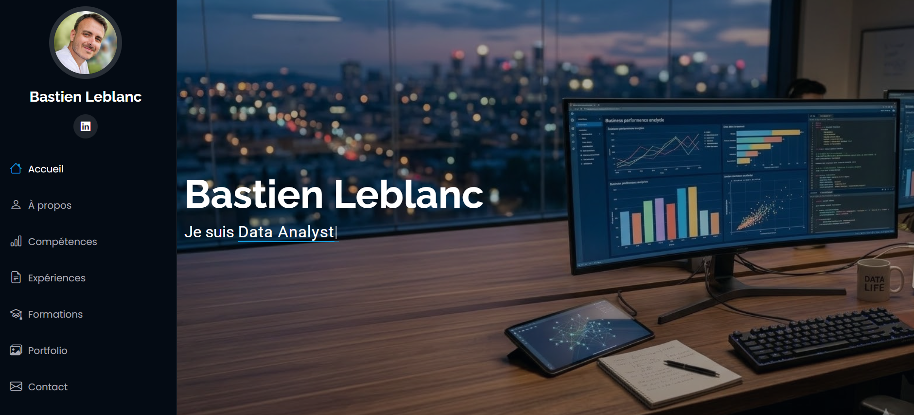
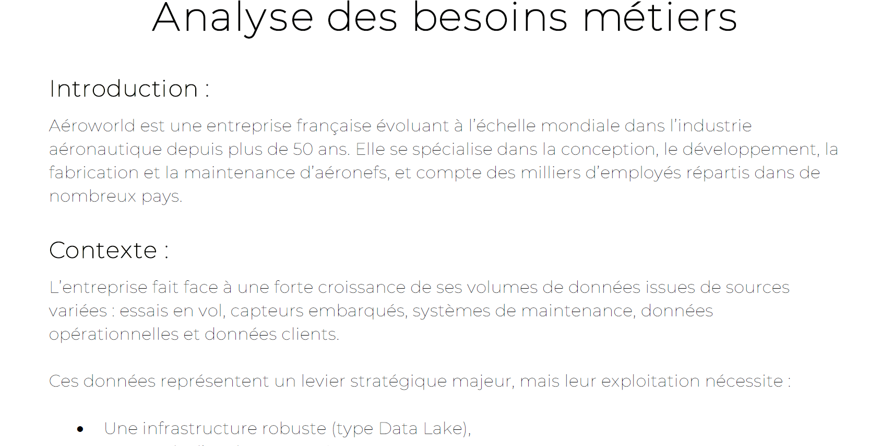
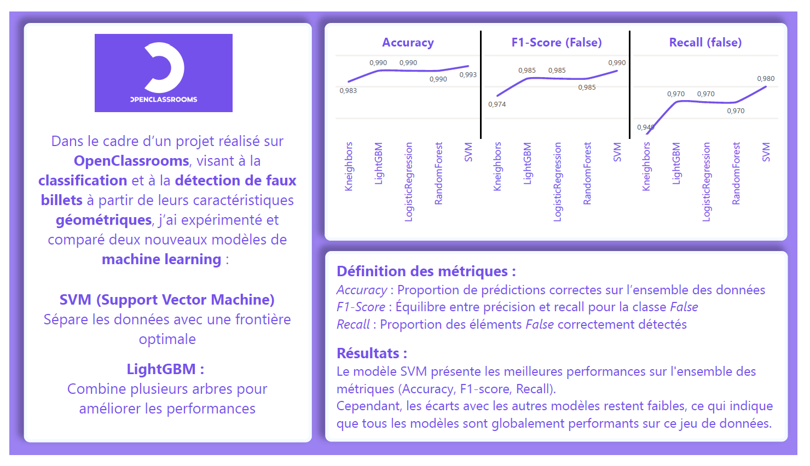
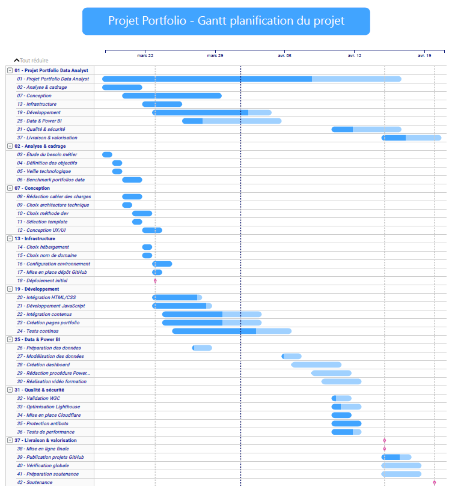
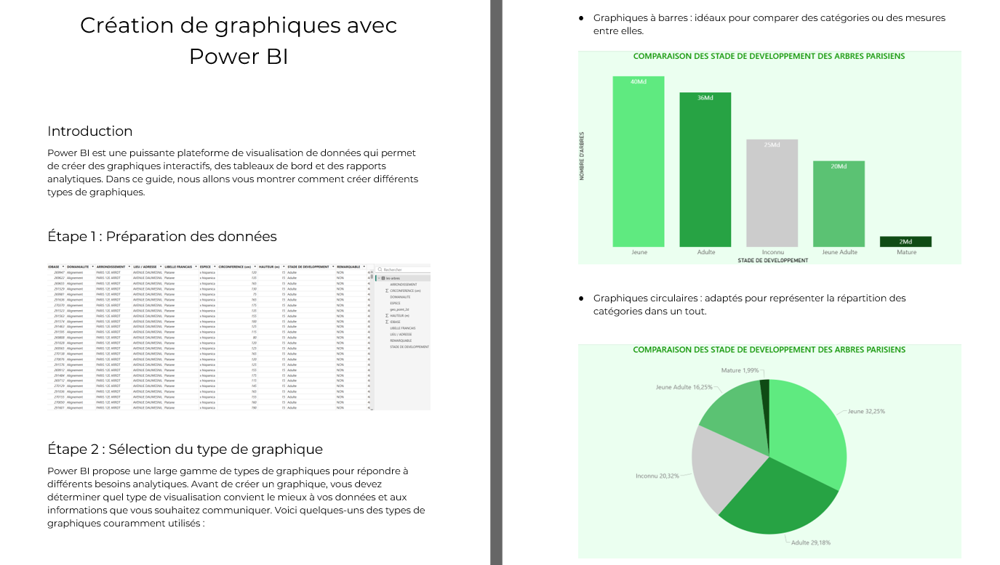
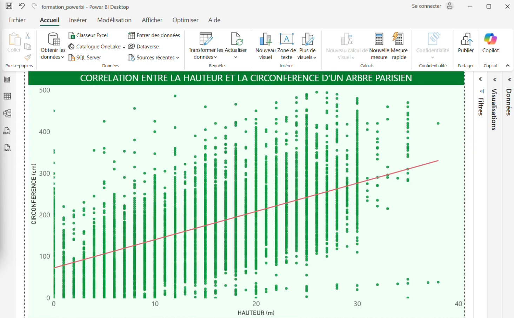

# Aeroworld
## Projet 13 - OpenClassRooms - Data Analyst

### Contexte :  
Vous êtes data analyst dans un cabinet de consultants spécialisé dans la transformation digitale des entreprises. 
Le cabinet compte déjà plus de 150 salariés et est en plein développement.
Chaque année avant le 1er mars, les entreprises d’au moins 50 salariés doivent calculer et publier sur leur site Internet leur index de l’égalité femmes-hommes

### Objectif :  
Postuler à l'offre d'emploi en construisant ces livrables :

### Livrables :  
* Portfolio en ligne (URL)
* Exprimer les besoins métier du cahier des charges (PDF)
* Tableau de bord présentant une veille métier (Power BI)
* Créer le cahier des charges du portfolio (PowerPoint)
* Présenter un diagramme de Gant du projet portfolio (Power BI)
* Réaliser une formation "création de visualisation sur Power BI" (Vidéo)
* Rédiger une procédure de "création de visualisation sur Power BI" (PDF)

## Livrables :   

  
<strong>Portfolio : </stong>

  
    
<strong>Besoins métier : </stong>

    
  </a>
    
<strong>Veille métier : </stong>

      
  </a>
    
<strong>Gantt projet Portfolio : </stong>

      
  </a>
    
<strong>Procédure Power BI : </stong>

     
      
<strong>Vidéo de formation Power BI : </stong>

      

